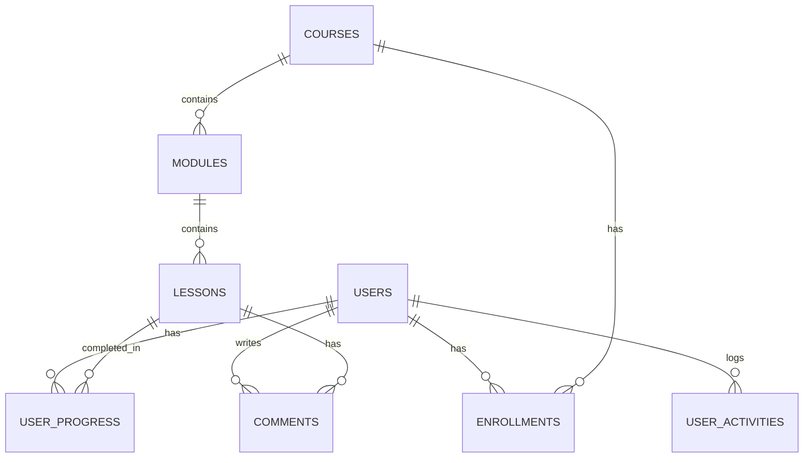

# Database Documentation

## Gambaran Umum

Database project ini menyimpan data pengguna, course, struktur materi, progress belajar, diskusi, dan gamification.

Tabel inti LMS:

- `users`
- `courses`
- `modules`
- `lessons`
- `enrollments`
- `user_progress`
- `comments`
- `user_activities`

Tabel bawaan Laravel yang juga ada:

- `password_reset_tokens`
- `sessions`
- `cache`
- `cache_locks`
- `jobs`
- `job_batches`
- `failed_jobs`
- `migrations`

## Diagram Relasi Sederhana

## Penjelasan Tabel Inti

### 1. users

Fungsi:

- menyimpan akun aplikasi
- menyimpan role user
- menyimpan data gamification dasar

Kolom penting:

| Kolom | Tipe | Fungsi |
|---|---|---|
| `id` | bigint | primary key user |
| `name` | string | nama user |
| `email` | string | email login, unik |
| `password` | string | password terenkripsi |
| `role` | enum | `admin`, `instructor`, `student` |
| `points` | integer | total poin belajar |
| `current_streak` | integer | streak aktif saat ini |
| `longest_streak` | integer | streak terpanjang |
| `last_activity_date` | timestamp nullable | aktivitas belajar terakhir |
| `email_verified_at` | timestamp nullable | status verifikasi email |

Relasi:

- one to many ke `enrollments`
- one to many ke `user_progress`
- one to many ke `comments`
- one to many ke `user_activities`

### 2. courses

Fungsi:

- menyimpan data course atau sertifikasi utama

Kolom penting:

| Kolom | Tipe | Fungsi |
|---|---|---|
| `id` | bigint | primary key course |
| `title` | string | judul course |
| `slug` | string unique | identifier untuk URL |
| `description` | text nullable | deskripsi course |
| `image` | string nullable | gambar thumbnail course |
| `status` | string | status `draft` atau `published` |

Relasi:

- one to many ke `modules`
- one to many ke `enrollments`

Catatan:

- belum ada kolom owner course seperti `instructor_id`

### 3. modules

Fungsi:

- membagi course menjadi beberapa bagian materi

Kolom penting:

| Kolom | Tipe | Fungsi |
|---|---|---|
| `id` | bigint | primary key module |
| `course_id` | foreign key | relasi ke course |
| `title` | string | judul module |
| `order_index` | integer | urutan module di course |

Relasi:

- many to one ke `courses`
- one to many ke `lessons`

### 4. lessons

Fungsi:

- menyimpan unit materi pembelajaran paling kecil
- mendukung teks, video, kuis, dan workspace coding

Kolom penting:

| Kolom | Tipe | Fungsi |
|---|---|---|
| `id` | bigint | primary key lesson |
| `module_id` | foreign key | relasi ke module |
| `title` | string | judul lesson |
| `content` | longText nullable | isi materi teks |
| `content_type` | string | jenis materi, misalnya `text` atau `video` |
| `video_url` | text nullable | URL embed atau file video |
| `order_index` | integer | urutan lesson dalam module |
| `quiz_question` | text nullable | pertanyaan kuis |
| `quiz_options` | json nullable | daftar pilihan jawaban |
| `quiz_correct_index` | integer nullable | indeks jawaban benar |
| `quiz_explanation` | text nullable | penjelasan setelah jawaban benar |
| `has_workspace` | boolean | apakah lesson punya editor coding |
| `code_html` | text nullable | starter code HTML |
| `code_css` | text nullable | starter code CSS |
| `code_js` | text nullable | starter code JavaScript |

Relasi:

- many to one ke `modules`
- one to many ke `user_progress`
- one to many ke `comments`

### 5. enrollments

Fungsi:

- mencatat user sudah mendaftar ke course tertentu

Kolom penting:

| Kolom | Tipe | Fungsi |
|---|---|---|
| `id` | bigint | primary key enrollment |
| `user_id` | foreign key | user yang mendaftar |
| `course_id` | foreign key | course yang diikuti |
| `enrolled_at` | timestamp | waktu pendaftaran |
| `status` | string | status enrollment, default `active` |

Relasi:

- many to one ke `users`
- many to one ke `courses`

Catatan:

- service memakai `firstOrCreate`, jadi user tidak akan didaftarkan dua kali dengan kombinasi yang sama selama data yang dicari cocok

### 6. user_progress

Fungsi:

- mencatat lesson yang sudah diselesaikan oleh user

Kolom penting:

| Kolom | Tipe | Fungsi |
|---|---|---|
| `id` | bigint | primary key progress |
| `user_id` | foreign key | user yang belajar |
| `lesson_id` | foreign key | lesson yang diselesaikan |
| `completed_at` | timestamp nullable | waktu selesai lesson |

Relasi:

- many to one ke `users`
- many to one ke `lessons`

Catatan:

- tabel ini menjadi dasar perhitungan progres course

### 7. comments

Fungsi:

- menyimpan diskusi atau komentar pada lesson

Kolom penting:

| Kolom | Tipe | Fungsi |
|---|---|---|
| `id` | bigint | primary key comment |
| `lesson_id` | foreign key | lesson yang dikomentari |
| `user_id` | foreign key | user penulis komentar |
| `body` | text | isi komentar |

Relasi:

- many to one ke `lessons`
- many to one ke `users`

### 8. user_activities

Fungsi:

- menyimpan akumulasi poin harian untuk heatmap aktivitas belajar

Kolom penting:

| Kolom | Tipe | Fungsi |
|---|---|---|
| `id` | bigint | primary key activity |
| `user_id` | foreign key | user yang beraktivitas |
| `date` | date | tanggal aktivitas |
| `points_earned` | integer | total poin yang didapat pada hari itu |

Relasi:

- many to one ke `users`

Constraint khusus:

- kombinasi `user_id` dan `date` harus unik

## Tabel Bawaan Laravel yang Relevan

### password_reset_tokens

Dipakai untuk reset password.

### sessions

Dipakai untuk session login jika driver session menggunakan database.

### cache dan cache_locks

Dipakai untuk cache jika driver cache database aktif.

### jobs, job_batches, failed_jobs

Disiapkan untuk queue Laravel.

## Relasi Bisnis Utama

### Relasi belajar

- satu course terdiri dari banyak module
- satu module terdiri dari banyak lesson
- satu user bisa mengambil banyak course melalui enrollment
- satu user bisa menyelesaikan banyak lesson melalui user progress

### Relasi diskusi

- satu lesson bisa memiliki banyak komentar
- satu user bisa menulis banyak komentar

### Relasi gamification

- total poin dan streak disimpan langsung di `users`
- riwayat poin harian disimpan di `user_activities`

## Bagaimana Progress Dihitung

Perhitungan progress course berjalan seperti ini:

1. sistem mengambil semua lesson di course tertentu
2. sistem menghitung jumlah total lesson
3. sistem menghitung jumlah lesson yang sudah ada di `user_progress`
4. progress dihitung dengan rumus berikut

$$
progress = \text{round}\left(\frac{lesson\ selesai}{total\ lesson} \times 100\right)
$$

## Bagaimana Sertifikat Ditentukan

Sertifikat tidak disimpan sebagai tabel khusus. Sertifikat dibuat langsung saat user meminta file PDF.

Aturan saat ini:

- jika progress course belum 100%, sertifikat ditolak
- jika progress 100%, PDF dibuat dari template Blade

## Seeder Data Awal

Seeder utama membuat:

- akun admin default
- akun student default
- satu course contoh `Belajar Dasar Pemrograman`
- module dan lesson contoh
- satu komentar contoh pada lesson awal

Referensi:

- [database/seeders/DatabaseSeeder.php](/home/ubuntu/Documents/LMSCOLAB/database/seeders/DatabaseSeeder.php)
- [database/seeders/CourseSeeder.php](/home/ubuntu/Documents/LMSCOLAB/database/seeders/CourseSeeder.php)

## Catatan dan Asumsi

- belum ada tabel kategori course
- belum ada tabel instructor ownership untuk course
- belum ada tabel nilai kuis terpisah, karena kuis dicek langsung di halaman lesson
- belum ada tabel sertifikat, karena file dibuat saat diminta

## Referensi Migration

- [database/migrations/2026_03_26_175911_create_courses_table.php](/home/ubuntu/Documents/LMSCOLAB/database/migrations/2026_03_26_175911_create_courses_table.php)
- [database/migrations/2026_03_26_175912_create_modules_table.php](/home/ubuntu/Documents/LMSCOLAB/database/migrations/2026_03_26_175912_create_modules_table.php)
- [database/migrations/2026_03_26_175913_create_lessons_table.php](/home/ubuntu/Documents/LMSCOLAB/database/migrations/2026_03_26_175913_create_lessons_table.php)
- [database/migrations/2026_03_26_175914_create_enrollments_table.php](/home/ubuntu/Documents/LMSCOLAB/database/migrations/2026_03_26_175914_create_enrollments_table.php)
- [database/migrations/2026_03_26_175915_create_user_progress_table.php](/home/ubuntu/Documents/LMSCOLAB/database/migrations/2026_03_26_175915_create_user_progress_table.php)
- [database/migrations/2026_03_26_194951_create_comments_table.php](/home/ubuntu/Documents/LMSCOLAB/database/migrations/2026_03_26_194951_create_comments_table.php)
- [database/migrations/2026_03_26_193805_create_user_activities_table.php](/home/ubuntu/Documents/LMSCOLAB/database/migrations/2026_03_26_193805_create_user_activities_table.php)