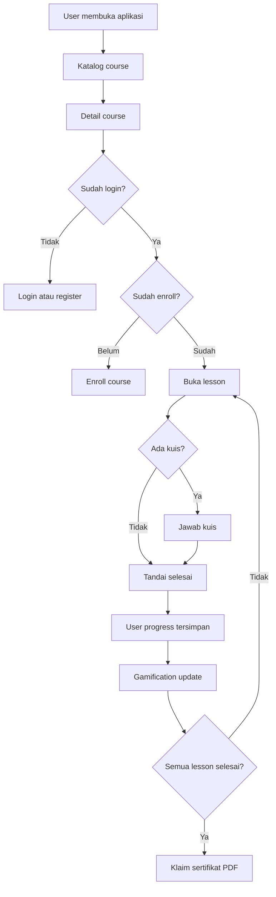

# System Architecture

## Tujuan Sistem

LMSColab dibangun untuk menyediakan alur belajar yang sederhana namun lengkap:

- user melihat kursus
- user mendaftar kursus
- user belajar per lesson
- sistem mencatat progres
- sistem memberi poin dan streak
- user mengunduh sertifikat setelah selesai

## Arsitektur Singkat

Project ini memakai arsitektur Laravel standar dengan pembagian yang cukup jelas:

- `routes/web.php` sebagai pintu masuk request web
- controller untuk mengatur request dan response
- service untuk business logic yang dipakai ulang
- model Eloquent untuk akses data
- Blade untuk tampilan
- migration dan seeder untuk database

## Komponen Utama

| Komponen | Lokasi | Fungsi |
|---|---|---|
| Routing | `routes/web.php` | Mendefinisikan route publik, student, instruktur, dan admin |
| Controller publik | `app/Http/Controllers` | Menangani katalog kursus, enrollment, lesson, komentar, sertifikat, dashboard |
| Controller instruktur | `app/Http/Controllers/Instructor` | CRUD course, module, lesson |
| Controller admin | `app/Http/Controllers/Admin` | CRUD akun user |
| Service | `app/Services` | Logic enrollment, progress, gamification |
| Model | `app/Models` | Representasi tabel database dan relasi |
| View | `resources/views` | Antarmuka user, instruktur, admin |
| Database migration | `database/migrations` | Struktur tabel dan perubahan schema |
| Seeder | `database/seeders` | Data awal untuk akun dan contoh course |

## Struktur Folder Penting

| Folder | Isi utama |
|---|---|
| `app/Http/Controllers` | Logic request utama aplikasi |
| `app/Http/Middleware` | Pembatasan akses role admin dan instruktur |
| `app/Models` | Model course, module, lesson, enrollment, progress, comment, activity |
| `app/Services` | Service layer yang mengelola proses bisnis |
| `database/migrations` | Definisi tabel database |
| `database/seeders` | Seeder akun dan sample course |
| `resources/views/courses` | Halaman katalog dan detail course |
| `resources/views/lessons` | Halaman lesson dan evaluasi |
| `resources/views/instructor` | Panel pengelolaan materi oleh instruktur |
| `resources/views/admin` | Panel pengelolaan akun oleh admin |

## Role dalam Sistem

### Student

- melihat course yang `published`
- mendaftar course
- membuka lesson setelah enrollment
- menjawab kuis
- menulis komentar
- melihat dashboard progres
- klaim sertifikat

### Instructor

- mengakses panel instruktur
- membuat dan mengubah course
- menambah module
- menambah lesson teks, video, kuis, dan workspace coding

### Admin

- memiliki akses instruktur juga
- mengelola akun user
- menentukan role user

## Flow Sederhana Sistem

## Flow Request per Layer

### 1. Route

Request dari browser masuk ke route Laravel. Contohnya:

- `/courses` untuk katalog
- `/courses/{slug}` untuk detail course
- `/courses/{slug}/lessons/{lesson}` untuk membuka lesson
- `/instructor/*` untuk panel instruktur
- `/admin/users` untuk panel admin

### 2. Controller

Controller mengatur validasi akses dan menyiapkan data untuk view.

Contoh:

- `CourseController` memuat daftar course publik dan detail course
- `LessonController` memeriksa enrollment lalu menampilkan lesson
- `CertificateController` memeriksa progres 100% sebelum membuat PDF

### 3. Service

Service menangani logic bisnis yang tidak cocok ditempatkan di controller.

- `EnrollmentService` memeriksa dan membuat enrollment
- `ProgressService` menghitung progres dan next lesson
- `GamificationService` menambah poin, streak, dan activity heatmap

### 4. Model dan Database

Model Eloquent menghubungkan controller dan service ke tabel database.

Contoh relasi utama:

- satu course punya banyak module
- satu module punya banyak lesson
- satu user bisa enroll ke banyak course
- satu user bisa menyelesaikan banyak lesson

### 5. View

View Blade menampilkan data ke user. Beberapa interaksi ringan memakai Alpine.js, terutama untuk:

- buka tutup kurikulum
- pemeriksaan kuis di lesson
- editor workspace coding dan live preview

## Flow per Fitur

### Enrollment

1. User membuka detail course.
2. User klik tombol daftar.
3. `EnrollmentController` memanggil `EnrollmentService`.
4. Data masuk ke tabel `enrollments`.
5. User bisa mengakses lesson course tersebut.

### Progress Belajar

1. User menyelesaikan lesson.
2. `LessonController` memanggil `ProgressService`.
3. Data completion disimpan ke `user_progress`.
4. Sistem menghitung ulang progres course.
5. Sistem mencari lesson berikutnya.

### Gamification

1. Saat lesson selesai, user mendapat poin.
2. `GamificationService` mengupdate `users.points`.
3. Sistem mengupdate streak harian di `users`.
4. Sistem mencatat heatmap aktivitas di `user_activities`.

### Certificate

1. User menyelesaikan semua lesson.
2. User klik klaim sertifikat.
3. `CertificateController` mengecek progres 100%.
4. DomPDF membuat file PDF dari Blade template.

## Asumsi dan Catatan dari Implementasi Saat Ini

### Kepemilikan course oleh instruktur

Saat ini tidak ada kolom seperti `instructor_id` pada tabel course. Artinya, panel instruktur belum membedakan course milik instruktur tertentu. Dokumentasi ini mengasumsikan semua instruktur yang lolos middleware dapat mengelola semua course.

### Verifikasi email

Route dashboard memakai middleware `verified`, tetapi model `User` belum mengimplementasikan `MustVerifyEmail`. Dokumentasi ini menganggap fitur verifikasi email belum final dan mungkin perlu penyesuaian jika ingin digunakan penuh.

### Queue

Script `composer run dev` menjalankan queue listener, tetapi dari analisis repository saat ini belum terlihat fitur queue khusus yang menjadi bagian inti LMS.

## File Referensi

- [routes/web.php](/home/ubuntu/Documents/LMSCOLAB/routes/web.php)
- [app/Http/Controllers/CourseController.php](/home/ubuntu/Documents/LMSCOLAB/app/Http/Controllers/CourseController.php)
- [app/Http/Controllers/LessonController.php](/home/ubuntu/Documents/LMSCOLAB/app/Http/Controllers/LessonController.php)
- [app/Http/Controllers/Instructor/CourseController.php](/home/ubuntu/Documents/LMSCOLAB/app/Http/Controllers/Instructor/CourseController.php)
- [app/Http/Controllers/Admin/UserController.php](/home/ubuntu/Documents/LMSCOLAB/app/Http/Controllers/Admin/UserController.php)
- [app/Services/EnrollmentService.php](/home/ubuntu/Documents/LMSCOLAB/app/Services/EnrollmentService.php)
- [app/Services/ProgressService.php](/home/ubuntu/Documents/LMSCOLAB/app/Services/ProgressService.php)
- [app/Services/GamificationService.php](/home/ubuntu/Documents/LMSCOLAB/app/Services/GamificationService.php)